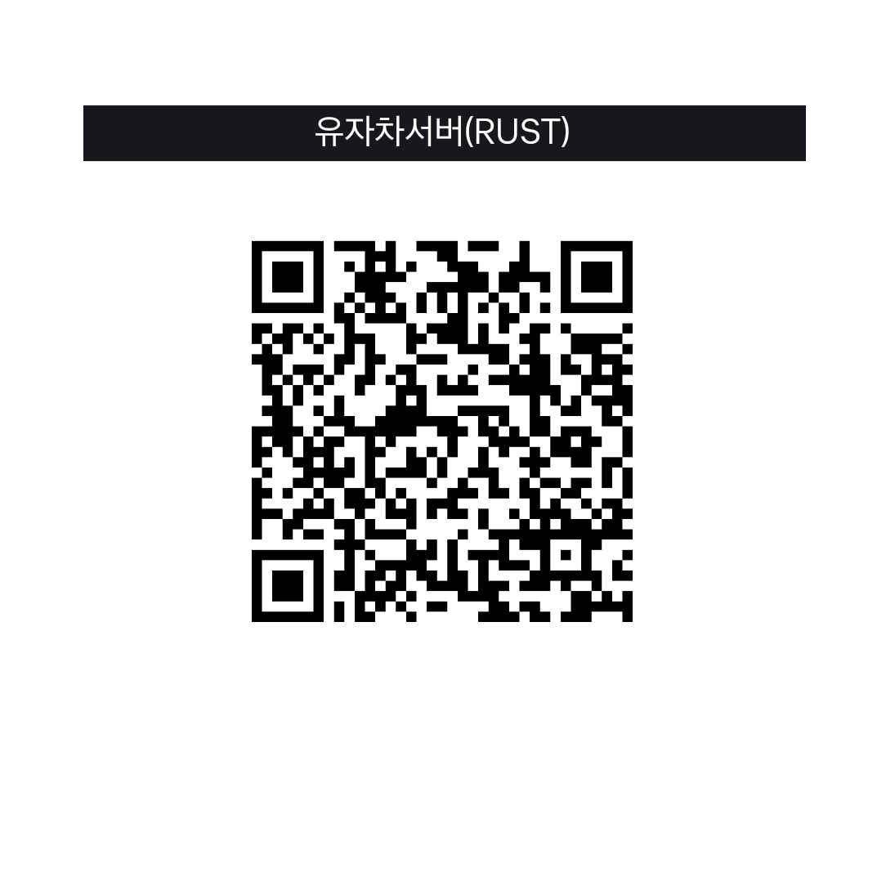
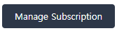

# 서포터 되기


서포터 명령 및 혜택에 관한 것은 Tebex[^1]를 참고하십시오.



자주묻는 질문에 관한 것은 [#support](faq.md#support "mention")를 참고하십시오.


## 서포트 방법 

***

### Tebex

Tebex[^2]에서 서포트가 가능하며 혜택이 5분 이내에 자동으로 지급된다. 우리는 가능한 한 서포트 방식별 지원속도에 차이를 두지 않고 있다. Tebex의 경우 모든 정보가 관리자에게 직접적으로 제공되기 때문에 가장 빠른 지원속도를 기대할 수 있다. 자동 갱신 지원.

### Discord

[Discord Nitro](#user-content-fn-3)[^3]에 포함된 서버 부스트 또는 [서버 부스트 단독](#user-content-fn-4)[^4]으로 유자차 서버를 부스트 할 경우 자동으로 지급된다. 자동 갱신 지원.


게임에서 **/auth** 명령으로 Steam과 Discord를 연동해야 지급된다.


### 계좌이체 

운영자 및 관리자 모두의 승인이 필요하기 때문에 혜택이 최대 1일 이내에 지급된다. 아래의 QR 코드를 스캔하거나 수동으로 입력하여 진행할 수 있다. 자동 갱신은 지원하지 않는다.

<figure><figcaption>
수동입력 : 토스뱅크 100044246925
</figcaption></figure>


입금 시 반드시 입금자명을 인 게임 닉네임으로 해야한다. 만약 그러지 않는 경우 본인확인을 위해 송금확인증을 관리자에게 첨부하여 전송해야 한다. 이 경우 혜택지급이 최대 2일 소요된다.


## &#x20;

## 서포트 해지하기 

***

아래 이미지와 같이 결제시 발송 된 이메일에 있는 버튼을 눌러 언제든지 요금 청구를 취소할 수 있다.

<figure><figcaption>
이메일에 포함된 버튼
</figcaption></figure>

[^1]: [외부 링크](https://yujachaserversupport.tebex.io/)

[^2]: [외부 링크](https://yujachaserversupport.tebex.io/)

[^3]: [외부 링크](https://support.discord.com/hc/ko/articles/115000435108-Nitro-Nitro-Basic%EC%9D%80-%EB%AC%B4%EC%97%87%EC%9E%85%EB%8B%88%EA%B9%8C#h_01GFV3NE6JPS6BRTX7XYQDJ0S4)

[^4]: [외부 링크](https://support.discord.com/hc/ko/articles/360028038352-Server-Boosting-FAQ-#h_9dfb44db-c394-4339-863b-e6d1e3fb0469)
