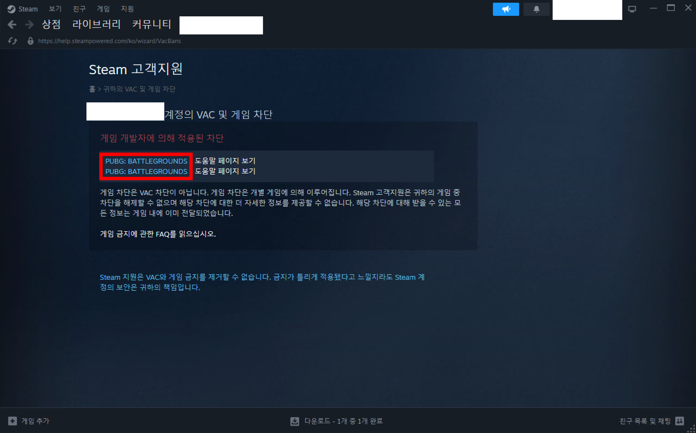

# 자주묻는 질문

## 게임 

***

레이드 블록(Raid Block)이란?

레이드 블록은 집을 때리거나 집이 공격당하면 발생한다. 이 동안에는 전투 공정성 및 도주 예방을 위해tp 및 일부 편의 기능을 사용할 수 없다.

서버에 접속되지 않거나 렉이 심함

* 디도스를 맞고 있는 것일 수 있다. 디도스의 경우 해결이 어렵기에 잠시 접속할 수 없고 다른 문제요소가 있다면 확인 후 디스코드 공지 채널에 메시지가 발행된다.
* [#connection-requirements](feature.md#connection-requirements "mention")을 충족하지 않는 것일 수 있다. VAC 차단의 경우 어떤 식으로든 서버에 접속이 불가능하다. [#undefined-6](faq.md#undefined-6 "mention")를 참고하여 해결방안을 시도해볼 수 있다.

서버가 목록에 보이지 않음

러스트 검색 옵션에서 기본적으로 빈 서버를 표시하고 있지 않기 때문일 수 있다. **빈 서버 표시(Show Empty)**를 켜면 보일 수도있다.

서버 재시동(점검) 소요시간

서버가 정상적인 경우 최대 30분 이내에 재시동이 완료된다.

스크랩 차를 마셨는데 배율이 적용되지 않음

기술적인 한계로 인해 차(Tea)에 대한 배율은 기본 배율로 작동한다.

안전구역에서 게임을 종료했더니 사망

안전구역에서 게임을 종료하면 자동으로 사망한다. 이는 러스트의 기본 기능으로 추측컨데 NPC나 플레이어가 아닌 [시스템에 의해 자동 사망](#user-content-fn-1)[^1]하는 것으로 보인다. 공식 서버에도 동일하게 적용된다.

여러 개 만들었지만 한 개의 아이템만 있음

유자차서버에는 [스택](feature.md#scale-speed)이 적용되어 있기 때문에 아이템을 겹칠 수 있다. 같은 내구도인 아이템이 겹쳐져서 한 개라고 착각할 수 있다. 제작된 아이템을 클릭해보면 제작한 개수만큼의 아이템이 모두 있다.

타사 게임 밴을 받았을 때 접속을 위한 절차

.png>)

스팀에서 내 프로필에 접근한다. 그리고 차단 기록 보기 버튼을 통해 밴 기록 화면에 접근한다. 그러면 어떤 게임에서 차단을 받았는지 확인되는데, 이때 이 스팀 화면을 전체 캡처하여 관리자에게 전송하면 확인되는대로 화이트리스트에 등록된다.

일부 상점 누락됨

각 맵마다 제공되는 상점이 상이하기 때문에 해당 주기의 맵에서는 일부 상점이 제공되지 않을 수 있다.

## 디스코드 

***

서버상태 채널에 있는 평균 FPS

서버상태중 평균 FPS라는 항목이 있다. 클라이언트의 최대 FPS에는 영향을 주지 않지만 20FPS 이하로 내려갈 경우 클라이언트의 성능에 영향[^2]을 줄 수 있다.

## 서포트 

***

해외 결제 가능한 카드가 없음

결제수단 중 하나로 결제하고 본인의 스팀 아이디로 로그인하면 결과적으로 본인이 후원한 것이 된다. 또는 [#supportmethod](become-a-supporter.md#supportmethod "mention")중 다른 방법을 사용할 수도 있다.

서포트가 예기치 않게 종료된 경우

관리자의 승인을 거쳐 최대 1일 이내 원하는 서포트 혜택 복구 시점을 선택할 수 있다. 예기치 않게 종료된 시점부터 서포트 혜택 복구 시점까지의 시간만큼 추가로 서포트 혜택이 제공된다.

구독 해지 방법

\
결제시 발송 된 이메일에 있는 버튼을 눌러 언제든지 요금 청구를 취소할 수 있다.

/clan join 명령이 작동하지 않음

본래 각 플레이어끼리 고유한 칭호를 사용해야 하는데, 팀 일때 라던지 같은 칭호를 사용하고 싶을 때 사용할 수 없는 불편함이 있다. 이러한 불편함을 해결할 수 있도록 제공되는 기능이므로 초대를 받는 사람도 서포터여야만 초대를 받을 수 있다.


[become-a-supporter.md](become-a-supporter.md)


[^1]: 자신이 마지막으로 죽은 방식으로 사망원인이 표시됨

[^2]: 렉
